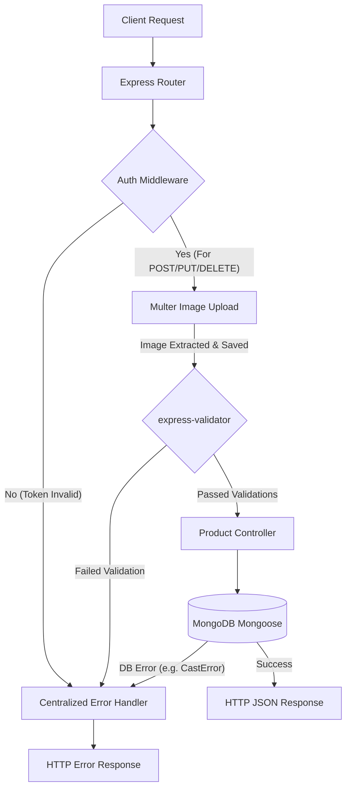

# Simple E-Commerce REST API

A production-grade, highly modular RESTful backend built with Node.js, Express, and MongoDB. This application manages user authentication (JWT-based session management through secure HTTP-only cookies) and e-commerce product catalogs featuring multiple image uploads, input validation, and category filtering.

---

## Technical Architecture & Core Features

*   **Design Pattern**: Model-View-Controller (MVC) directory structure separating routes, controllers, database models, and custom middlewares.
*   **Authentication Flow**: Strict JSON Web Token (JWT) architecture. Users receive an `accessToken` (15m expiry) and a `refreshToken` (7d expiry) via HTTP-Only cookies to protect against XSS (Cross-Site Scripting) and CSRF vulnerabilities.
*   **File Upload Pipeline**: Configured using `Multer` disk storage. Supports uploading up to 5 product images simultaneously, validates image MIME-types/extensions, and implements a 5MB per-file size limit.
*   **Request Validation**: Robust request payload validation utilizing `express-validator` to enforce semantic data constraints (e.g., non-empty strings, positive numeric price checks) before invoking controllers.
*   **Centralized Error Handling**: A unified error-handling middleware that intercept and maps Mongoose database errors (e.g., CastError, Duplicate key), validation errors, and upload-specific limits into descriptive, standard HTTP responses.

---

## Directory Structure

```text
├── src/
│   ├── config/
│   │   └── db.js                 # MongoDB connection logic using Mongoose
│   ├── controllers/
│   │   ├── auth.controller.js    # Register & Login controllers
│   │   └── product.controller.js # CRUD controllers for product management
│   ├── middleware/
│   │   ├── auth.middleware.js    # JWT verifying session gatekeeper
│   │   ├── error.middleware.js   # Centralized Express error handler
│   │   ├── product.validator.js  # express-validator schema rules for product body
│   │   └── upload.middleware.js  # Multer disk-storage & filter configuration
│   ├── model/
│   │   ├── product.model.js      # Mongoose Schema for Products
│   │   └── user.model.js         # Mongoose Schema & JWT generation instance methods for Users
│   ├── routes/
│   │   ├── auth.routes.js        # Auth routing maps
│   │   └── product.routes.js     # Product routing maps
│   └── app.js                    # Express application configuration & middleware stack
├── uploads/                      # Automatically created directory containing uploaded image files
├── .env                          # Local environment variables config (ignored in Git)
├── .gitignore                    # Git file exclusions
├── server.js                     # Main application entry point running the HTTP server
├── package.json                  # Project dependencies and script declarations
└── README.md                     # Comprehensive setup and API guides
```

---

## Setup & Installation

### Prerequisites
*   [Node.js](https://nodejs.org/) (v16+ recommended)
*   [MongoDB](https://www.mongodb.com/) (running locally or an Atlas connection URI)

### 1. Clone & Install Dependencies
Navigate into your workspace and install the required node packages:
```bash
npm install
```

### 2. Configure Environment Variables
Create a `.env` file in the root directory and add the following keys:
```env
PORT=3000
MONGODB_URL=mongodb://localhost:27017/cluster_ecommerce
MONGODB_URI=mongodb://localhost:27017/cluster_ecommerce
JWT_SECRET=herryqv25792v5hbj235iafu230452dfhw3dsfhe
ACCESS_TOKEN_SECRET=herryqv25792v5hbj235iafu230452dfhw3dsfhe
REFRESH_TOKEN_SECRET=asigep2367tgahpewuj3q48yvweugtn35445hg
```

### 3. Run the Server
*   **Development Mode** (boots with `nodemon` for auto-reloading):
    ```bash
    npm run dev
    ```
*   **Production Mode**:
    ```bash
    npm start
    ```

---

## API Lifecycle & Execution Flow



---

## Postman API Testing Guide

Since the application uses **HTTP-Only Cookies** for authentication and **Multipart Form-Data** for uploads, configure your Postman requests as follows:

### Step 1: User Registration
Set up a request to register a test user:
*   **Method**: `POST`
*   **URL**: `http://localhost:3000/api/register`
*   **Headers**: `Content-Type: application/json`
*   **Body**: Choose **raw** option and select **JSON** type. Enter:
    ```json
    {
      "name": "Jane Doe",
      "email": "jane@example.com",
      "mobile": "+12345678901",
      "password": "securePassword123"
    }
    ```
*   **Action**: Click **Send**.
*   *Note*: The API will respond with `201 Created` and return cookies named `accessToken` and `refreshToken` in Postman's **Cookies** tab.

---

### Step 2: User Login
To establish a fresh session:
*   **Method**: `POST`
*   **URL**: `http://localhost:3000/api/login`
*   **Headers**: `Content-Type: application/json`
*   **Body**: Choose **raw** -> **JSON**:
    ```json
    {
      "email": "jane@example.com",
      "password": "securePassword123"
    }
    ```
*   **Action**: Click **Send**.
*   *Note*: Verify that the cookies are visible under the **Cookies** tab inside Postman. Postman will automatically manage and attach these cookies to subsequent requests.

---

### Step 3: Create Product (Multiple Image Uploads)
This endpoint requires authentication and multipart form-data because of image files.
*   **Method**: `POST`
*   **URL**: `http://localhost:3000/api/products`
*   **Authentication**: None needed in the Auth tab (Postman automatically includes the cookies from the active session).
*   **Body**: Select **form-data** option. Set the keys as follows:
    1.  `name` (Text): `Mechanical Keyboard`
    2.  `price` (Text): `89.99`
    3.  `category` (Text): `electronics`
    4.  `description` (Text): `Premium mechanical keyboard with customizable RGB backlighting.`
    5.  `images` (File): *Hover over the key input row in Postman, click the dropdown to change from **Text** to **File**. Click **Select Files** and choose up to 5 image files from your computer.*
*   **Action**: Click **Send**.
*   **Expected Response**: `201 Created` containing the details of the created product and an `images` array with the file names generated by Multer (e.g. `1685458925401-123456789.png`).

---

### Step 4: Get All Products & Category Filtering
*   **Method**: `GET`
*   **URL**: `http://localhost:3000/api/products`
*   **To Filter by Category**: Append a query parameter `category`:
    `http://localhost:3000/api/products?category=electronics`
*   **Action**: Click **Send**.
*   **Expected Response**: `200 OK` listing matched products.

---

### Step 5: Update Product details
To update an existing product:
*   **Method**: `PUT`
*   **URL**: `http://localhost:3000/api/products/<product_id>` (Replace `<product_id>` with the `_id` field from a product created in Step 3).
*   **Body**: Select **form-data** or **raw** (JSON). To update name/price:
    *   `price`: `79.99`
    *   `description`: `Mechanical keyboard (On Sale!).`
*   **Action**: Click **Send**.
*   **Expected Response**: `200 OK` showing the updated fields.

---

### Step 6: Delete Product
*   **Method**: `DELETE`
*   **URL**: `http://localhost:3000/api/products/<product_id>` (Replace `<product_id>` with the product's Mongoose `_id`).
*   **Action**: Click **Send**.
*   **Expected Response**: `200 OK` confirming the deletion.
